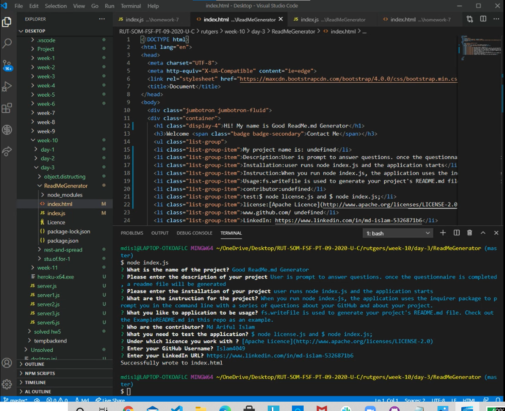

# GoodReadMeGenerator

## Description
What, Why, and How:

This Application uses Node.js, fs and Inquirer to create the promts for the user to fill out the answer and then constructs Readme.md files.
## Table of Contents
* [INTALLATION](#Installation)
* [INSTRUCTION](#Instruction)
* [USAGE](#Usage)
* [CONTRIBUTOR](#Contributor)
* [TEST](#Test)
* [LICENSE](#License)

## Installation:
You can clone the link to generate.

 [GIT CLONE](https://github.com/Islam4049/ReadMeGenarator)
 
  Need to install:

  $npm init , $ npm install....

## Instruction
* [`inquirer`](https://www.npmjs.com/package/inquirer) that will prompt you for your inputs from the command-line 
User is prompt to answer questions. once the questionnaire is completed, a readme file will be generated

user runs node index.js and the application starts

## Usage:

When you run node index.js, the application uses the inquirer package to prompt you in the command line with a series of questions about your GitHub and about your project.

=> fs.writeFile is used to generate your project's README.md file. Check out the ExampleREADME.md in this repo as an example. 

## Contributor: 
["Md Ariful Islam"](https://github.com/Islam4049)

## Test
To test for the application you need :

$ node license.js and $ node index.js;

## License
 [Apache Licence](http://www.apache.org/licenses/LICENSE-2.0)

For any questions, please contact me with the information below:

[Just Send me An email](mdislam4049@gmail.com)

[Visit my Github profile](https://github.com/Islam4049)

## Walk thrugh the Video:
[video of the generate process](https://drive.google.com/file/d/1EPcuZXDhLOsgJGGOlKm9Ei2qjGli2GIY/view?usp=sharing)

